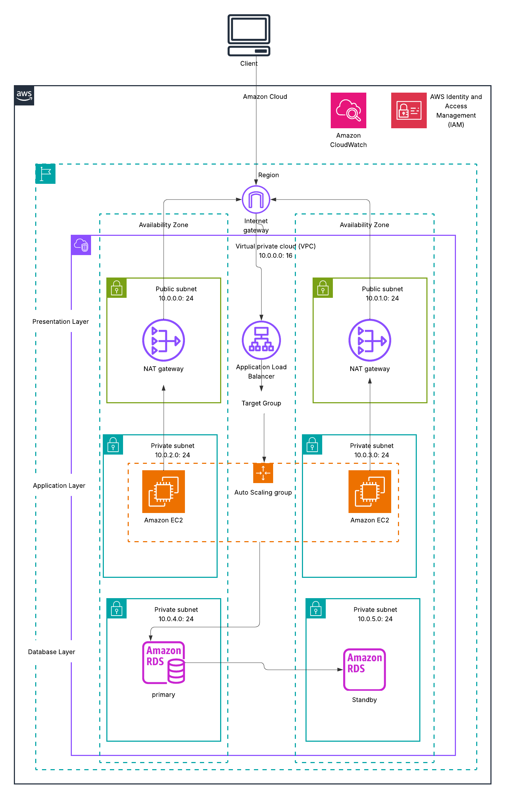

[README.md](https://github.com/user-attachments/files/26361061/README.md)
# 🏗️ AWS 3-Tier Highly Available Architecture


> Graduation project for the **AWS Certified Solutions Architect – Associate (SAA-C03)** learning path.  
> A production-ready, highly available and scalable 3-tier web application architecture on AWS.

---

## 📌 Project Overview

This project demonstrates a **3-tier architecture** on AWS designed for high availability, security, and scalability. The architecture separates the infrastructure into three distinct layers — Presentation, Application, and Database — each deployed across **two Availability Zones** to eliminate single points of failure.

---

## 🎯 Project Objectives

- Design a fault-tolerant architecture using **Multi-AZ** deployment
- Implement secure networking with **public and private subnets**
- Apply automatic scalability using **Auto Scaling Groups**
- Distribute traffic efficiently using **Application Load Balancer**
- Protect data with **RDS Multi-AZ** replication
- Monitor infrastructure health with **CloudWatch** and **SNS** alerts
- Follow **AWS Well-Architected Framework** best practices

---

## 🖼️ Architecture Diagram



---

## 🏛️ Architecture Layers

### 1️⃣ Presentation Layer — Public Subnets
| Component | Details |
|---|---|
| **Internet Gateway** | Entry point for all inbound traffic |
| **Application Load Balancer (ALB)** | Single ALB spanning both AZs, distributes traffic via Target Groups |
| **NAT Gateway** | One per AZ — allows EC2 instances to access the internet securely |

### 2️⃣ Application Layer — Private Subnets
| Component | Details |
|---|---|
| **Amazon EC2** | Web/app servers deployed in private subnets (AZ1 & AZ2) |
| **Auto Scaling Group (ASG)** | Automatically scales EC2 instances based on CPU utilization |
| **Security Group** | Allows HTTP/HTTPS traffic from ALB only |

### 3️⃣ Database Layer — Private Subnets
| Component | Details |
|---|---|
| **Amazon RDS (Primary)** | Deployed in AZ1 private subnet |
| **Amazon RDS (Standby)** | Deployed in AZ2 — synchronous replication from Primary |
| **Multi-AZ Failover** | Automatic failover if Primary becomes unavailable |

---

## 🌐 Network Design

```
VPC: 10.0.0.0/16
│
├── Availability Zone 1
│   ├── Public Subnet   10.0.0.0/24   → NAT Gateway
│   ├── Private Subnet  10.0.2.0/24   → EC2 (App Layer)
│   └── Private Subnet  10.0.4.0/24   → RDS Primary
│
└── Availability Zone 2
    ├── Public Subnet   10.0.1.0/24   → NAT Gateway
    ├── Private Subnet  10.0.3.0/24   → EC2 (App Layer)
    └── Private Subnet  10.0.5.0/24   → RDS Standby
```

---

## 🔄 Traffic Flow

```
Internet
   │
   ▼
Internet Gateway
   │
   ▼
Application Load Balancer (ALB)
   │              │
   ▼              ▼
EC2 (AZ1)     EC2 (AZ2)      ← Auto Scaling Group
   │              │
   └──────┬───────┘
          ▼
    RDS Primary (AZ1)
          │  Synchronous Replication
          ▼
    RDS Standby (AZ2)
```

**Outbound path (EC2 → Internet):**
```
EC2 (Private Subnet) → NAT Gateway (Public Subnet) → Internet Gateway → Internet
```

---

## 🔐 Security Design

| Layer | Security Measure |
|---|---|
| **Internet → ALB** | ALB Security Group: allows HTTP (80) / HTTPS (443) from `0.0.0.0/0` |
| **ALB → EC2** | EC2 Security Group: allows traffic from ALB Security Group only |
| **EC2 → RDS** | RDS Security Group: allows port 3306/5432 from EC2 Security Group only |
| **RDS** | Not publicly accessible — isolated in private subnets |
| **IAM** | EC2 instances use IAM Roles — no hardcoded credentials |

---

## 📈 Scalability & High Availability

- **ALB** performs health checks and routes traffic only to healthy instances
- **Auto Scaling Group** scales out when CPU > 70%, scales in when CPU < 30%
- **Multi-AZ RDS** provides automatic failover (typically under 2 minutes)
- **NAT Gateway per AZ** avoids cross-AZ dependency

---

## 📊 Monitoring & Alerting

| Service | Purpose |
|---|---|
| **Amazon CloudWatch** | Monitors EC2 CPU, ALB request count, RDS connections |
| **CloudWatch Alarms** | Triggers alerts on threshold breaches |
| **Amazon SNS** | Sends email/SMS notifications when alarms fire |

---

## ☁️ AWS Services Used

| Service | Role |
|---|---|
| Amazon VPC | Network isolation |
| Internet Gateway | Public internet access |
| NAT Gateway | Outbound internet for private resources |
| Application Load Balancer | Traffic distribution |
| Amazon EC2 | Web application servers |
| Auto Scaling Group | Automatic capacity management |
| Amazon RDS (Multi-AZ) | Managed relational database |
| AWS IAM | Access control and roles |
| Amazon CloudWatch | Monitoring and metrics |
| Amazon SNS | Alert notifications |

---

## 📁 Repository Structure

```
aws-3-tier-highly-available-architecture/
│
├── README.md                      # Project documentation (this file)
├── architecture.png               # Architecture diagram
├── LICENSE                        # MIT License
├── .gitignore
│
└── docs/
    ├── implementation-steps.md    # Step-by-step AWS Console setup guide
    └── design-decisions.md        # Why each service and design choice was made
```

---

## 📄 Documentation

- 📘 [Implementation Steps](docs/implementation-steps.md) — Step-by-step guide to deploy this architecture on AWS
- 💡 [Design Decisions](docs/design-decisions.md) — Explanation of architectural choices

---

## 🎥 Project Demo

> 🔗 Coming soon — recorded walkthrough of the deployed architecture.

---

## 💼 Skills Demonstrated

- AWS VPC design and subnet architecture
- Application Load Balancer configuration
- Auto Scaling policies and launch templates
- RDS Multi-AZ setup and failover
- Security Groups and least-privilege access
- CloudWatch monitoring and SNS alerting
- AWS Well-Architected Framework principles

---

## 👩‍💻 Author

**Kenza Behlouli**  
AWS Solutions Architect – Associate candidate  
[GitHub](https://github.com/Kenza-BHL)

---

## 📜 License

This project is licensed under the [MIT License](LICENSE).
